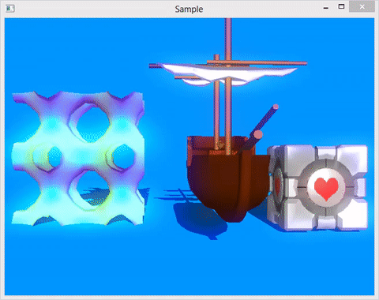

# Graphics 3d engine for qt

Need qt version >= 5.4

Features
---------------
- Draw Call Batching
- Painter's algorithm for alpha objects
- Creating custom shaders
- Load / save .3ds
- Animation
- Skinned mesh
- Planar shadows
- Isosurfaces (marching cubes)

